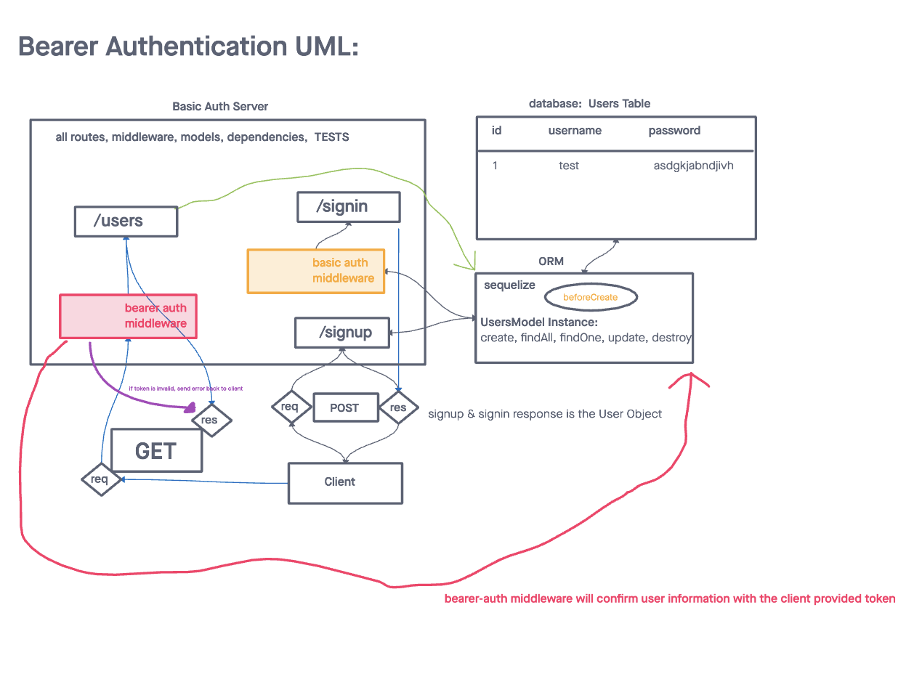

# LAB - Class 07

## Project: Bearer Auth

### Author: Heather Holcomb | 401d53

### Problem Domain

An Express/Node.js based server using a custom “authentication” module that is designed to handle user registration and sign in using Basic, Bearer, or OAuth along with a custom “authorization” module that will grant/deny users access to the server based on their role or permissions level.

### Links and Resources

- [GitHub Actions ci/cd](https://github.com/holcombheather/bearer-auth/actions)
- [back-end server url](https://basic-auth-sw7m.onrender.com)

### Collaborators

- Referenced class demo code taught by Ryan Gallaway

### Setup

1. Clone this repo into your local environment
2. `npm init -y`
3. `npm i cors express jest supertest sequelize sequelize-cli sqlite3 pg base-64 bcrypt eslint dotenv jsonwebtoken`

#### `.env` requirements (where applicable)

- `PORT` - 3001
- `DATABASE_URL` - see `.env.sample`

#### How to initialize/run your application (where applicable)

- `npm start` or `nodemon`

#### How to use your library (where applicable)

#### Features / Routes

Auth Module Requirements
- Users can create an account, associated with a “role”
- User Roles will be pre-defined and will each have a list of allowed capabilities
    - `admin` can read, create, update, delete
    - `editor` can read, create, update
    - `writer` can read, create
    - `user` can read
- Users can then login with a valid username and password
- Alternatively, users can login using an OAuth provider such as Google or GitHub
    - In this case, users should be automatically assigned the role of user
- Once logged in, Users can then access any route on the server, so long as they are permitted by the capabilities that match their role.
    - For example, a route that deletes records should only work if your user role is “admin”

Lab 07 Requirements
- As a user, I want to obtain a token after I signin, so that I can re-authenticate
- As a user, I want to use my token to access routes that require a valid user

#### Tests

- `npm test`
- fails a login for a user (admin) with the incorrect basic credentials
- logs in an admin user with the right credentials
- fails a login for a user (admin) with an incorrect token
- logs in a user with a proper token

#### UML

